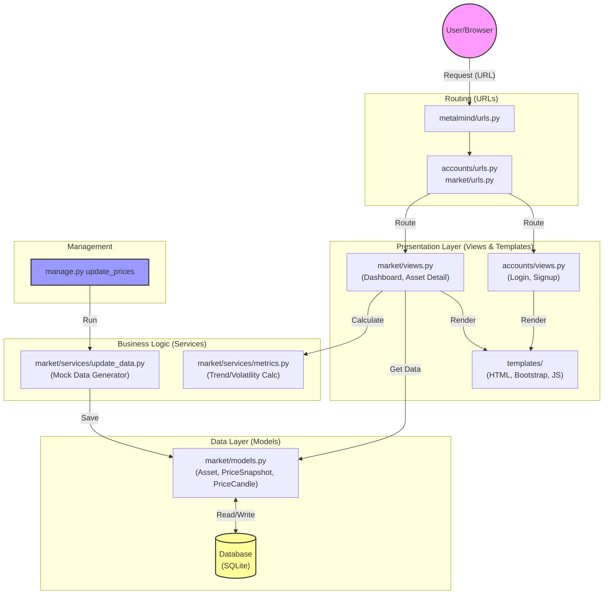

# System Architecture

This flowchart illustrates how the MetalMind application processes requests and manages data.

## Description of Components

1.  **Routing**: Incoming web requests are routed via `metalmind/urls.py` to the specific app URLs (`accounts/urls.py` or `market/urls.py`).
2.  **Views**:
    *   `accounts/views.py`: Handles user registration and authentication utilizing custom forms (`accounts/forms.py`).
    *   `market/views.py`: Fetches asset data, calculates metrics using services, and prepares the context for templates.
3.  **Templates**: HTML files in `templates/` render the UI using Bootstrap. They display data passed from views (e.g., price charts, tables).
4.  **Services**:
    *   `metrics.py`: Contains pure logic for calculating trends and volatility, keeping views clean.
    *   `update_data.py`: Generates mock market data (prices, candles).
5.  **Models & Database**: `market/models.py` defines the data structure (`Asset`, `PriceSnapshot`). The application interacts with the SQLite database through these models.
6.  **Management Commands**: `update_prices` is a command-line tool that triggers `update_data.py` to populate the database, essential for the "Update Data" feature.
