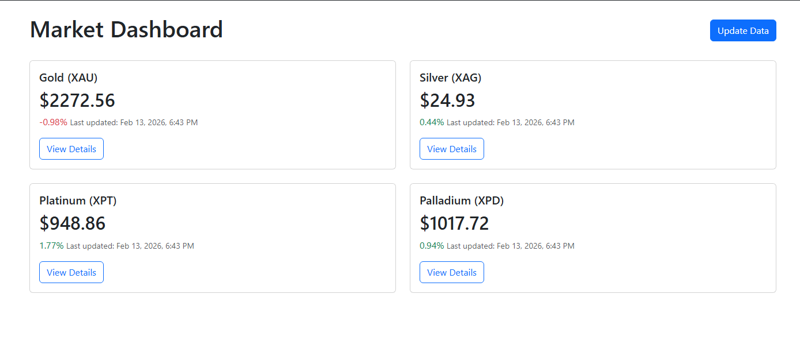
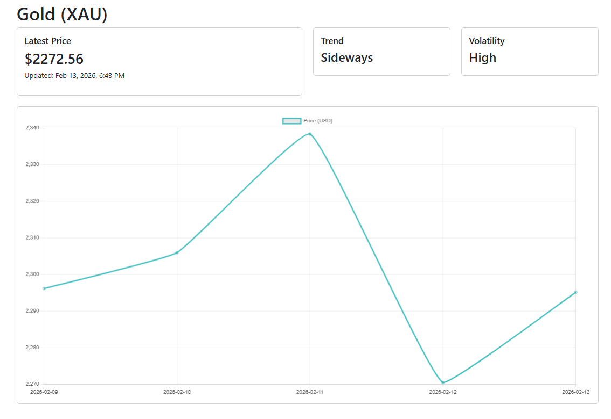

# MetalMind 🪙🧠

**MetalMind** is a beginner-friendly Django web application designed to track asset prices like Gold and Silver. It features a clean dashboard, interactive charts, and automated trend analysis to help users visualize market movements.

---

## 🚀 Features

- **User Authentication**: Secure Login and Signup flows.
- **Interactive Dashboard**: View real-time asset prices and daily changes at a glance.
- **Smart Metrics**: Automated calculation of **Trend** (Up/Down/Sideways) and **Volatility** (High/Medium/Low).
- **Visual Charts**: 5-day price history visualization using **Chart.js**.
- **Mock Data Generator**: Built-in simulation tool to generate realistic market data for testing.
- **Manual Updates**: "Update Data" button to trigger fresh data fetch (mocked for v0.1).

---

## 🛠️ Tech Stack

- **Backend**: Python, Django 4.x
- **Database**: SQLite (easy setup)
- **Frontend**: HTML5, Bootstrap 5
- **Visualization**: Chart.js
- **Version Control**: Git & GitHub

---

## 💻 Local Setup

Follow these steps to get MetalMind running on your machine:

1.  **Clone the repository:**

    ```bash
    git clone https://github.com/RicheekB/metalmind.git
    cd metalmind
    ```

2.  **Set up a virtual environment (recommended):**

    ```bash
    python -m venv venv
    # Windows
    venv\Scripts\activate
    # Mac/Linux
    source venv/bin/activate
    ```

3.  **Install dependencies:**

    ```bash
    pip install django
    ```

4.  **Initialize the database:**

    ```bash
    python manage.py migrate
    ```

5.  **Generate mock data:**

    ```bash
    python manage.py update_prices --days 5
    ```

6.  **Run the server:**
    ```bash
    python manage.py runserver
    ```
    Open your browser at [http://127.0.0.1:8000/](http://127.0.0.1:8000/).

---

## 📂 Project Structure

- `accounts/`: Handles user authentication (login, signup, logout).
- `market/`: Core app logic for assets, prices, and metrics.
- `market/services/`: Business logic (data updates, math for trends/volatility).
- `templates/`: HTML files using Bootstrap and Django Template Language.
- `manage.py`: Django's command-line utility.

---

## 🗺️ Roadmap

- **v0.1**: Initial Release (Mock Data) ✅
- **v0.2**: User Settings & Enhanced Dashboard
- **v0.3**: Comprehensive Unit & Integration Tests 🚧
- **v0.4**: Docker Support & MySQL Migration
- **v0.5**: Integration with Real-Time Price API (e.g., AlphaVantage)
- **v0.6**: AI-Powered Market Summaries

---

## 📸 Screenshots

### Dashboard Interface



### Asset Detail with Chart



---

## 👤 Creator

Created by **Richeek Basu**.

View on [GitHub](https://github.com/RicheekB)

---

_License: MIT_
